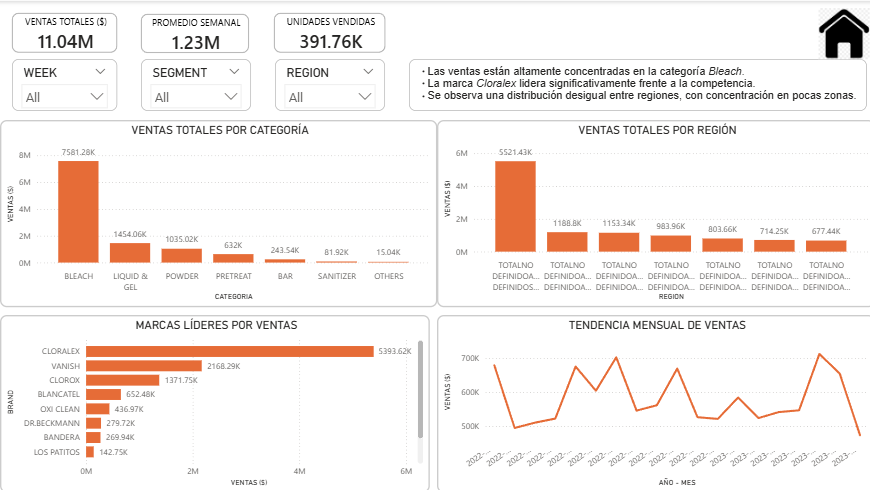
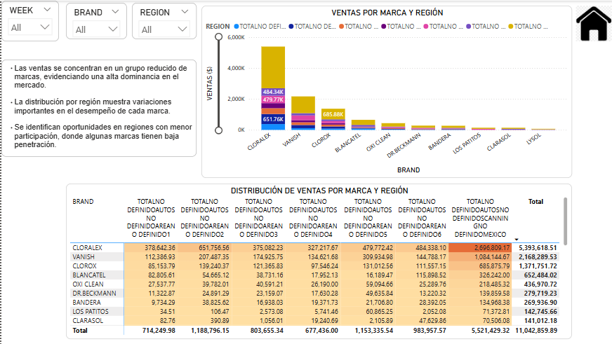
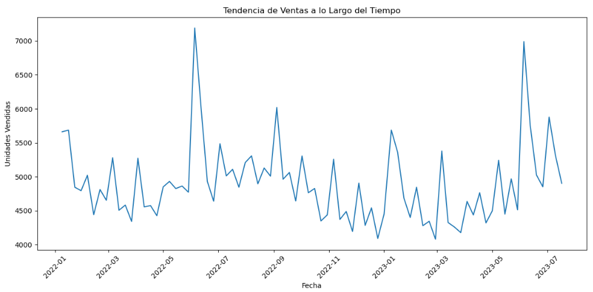
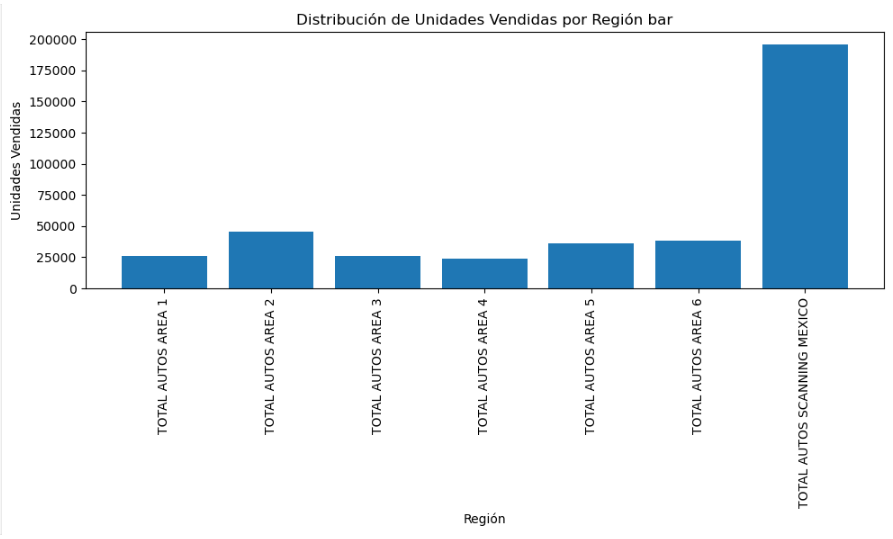
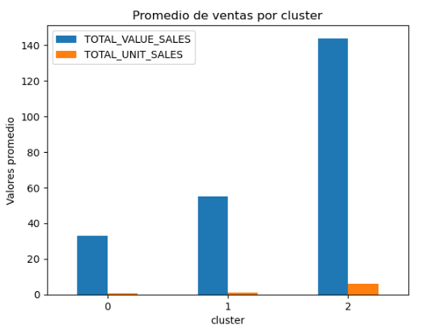
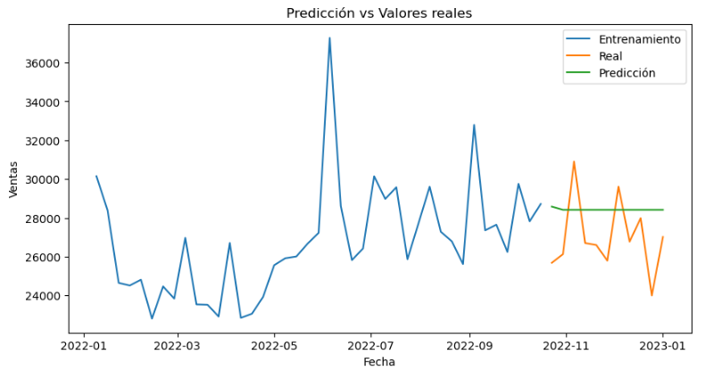

# 📊 Reckitt - Análisis de Ventas y Dashboard Empresarial

## 📌 Descripción del Proyecto
Este proyecto consiste en un análisis de ventas desarrollado utilizando Power BI, SQL y Python, enfocado en identificar tendencias comerciales, rendimiento de productos, comportamiento regional y oportunidades estratégicas de negocio para marcas de Reckitt.

El objetivo principal fue transformar datos empresariales en información visual e interactiva que facilite la toma de decisiones basada en datos.

---

# 🎯 Objetivos del Proyecto
- Analizar tendencias de ventas y rendimiento comercial
- Identificar productos y categorías con mejor desempeño
- Evaluar el comportamiento de ventas por región
- Detectar oportunidades de crecimiento y optimización
- Construir dashboards interactivos para análisis empresarial

---

# 🛠️ Herramientas y Tecnologías Utilizadas
- Power BI
- SQL
- Python
- Pandas
- Excel
- Visualización de Datos
- Análisis Exploratorio de Datos (EDA)

---

# 📂 Conjunto de Datos
El dataset utilizado contiene información relacionada con:
- Ventas
- Categorías de productos
- Regiones
- Ingresos
- Tendencias temporales
- Rendimiento comercial

Fuente:
- Dataset educativo utilizado con fines de análisis y visualización de datos.

---

# 📈 Características del Dashboard
El dashboard incluye:
- KPIs principales de ventas
- Tendencias mensuales
- Comparación de categorías
- Rendimiento regional
- Análisis de productos
- Navegación interactiva
- Visualizaciones dinámicas

---

# 🖼️ Visualizaciones

## Dashboard de Ventas



---

## Dashboard de Análisis de Productos



---

## Tendencia de Ventas



---

## Análisis Regional



---

## Promedio de Ventas por Cluster



---

## Predicción de Ventas



---

# 🔍 Principales Insights
- Algunas categorías de productos mostraron un crecimiento significativo en ingresos.
- Existen diferencias importantes en rendimiento entre regiones.
- Se identificaron tendencias estacionales que impactan las ventas mensuales.
- Los dashboards permiten detectar patrones comerciales de manera visual e interactiva.

---

# ✅ Conclusiones
El análisis permitió obtener insights relevantes para comprender el comportamiento comercial de las marcas y apoyar la toma de decisiones estratégicas mediante herramientas de Business Intelligence y análisis de datos.

---

# 📁 Estructura del Repositorio

```text
data/          -> datasets y archivos fuente
dashboard/     -> archivos Power BI
images/        -> capturas y visualizaciones
notebooks/     -> notebooks y análisis en Python
```
